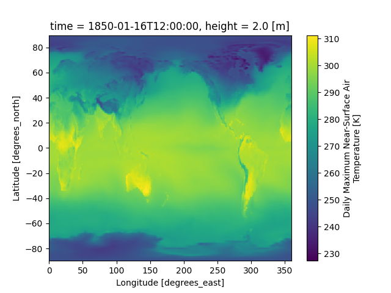
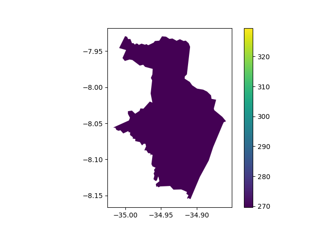
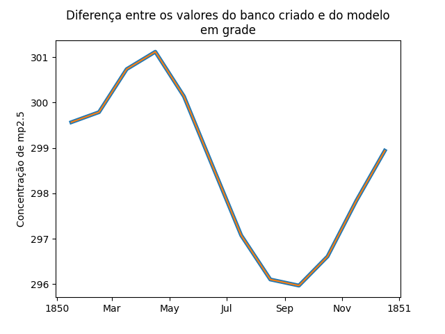

# Compostos Químicos no Ar: Dados do CMIP6
- Feito com a ajuda do Professor Alexandre Candido Xavier [Github do professor]([https://drive.google.com/file/d/1d-7Vkpt5SBiSeaS1iq4q3gj-ijoa5iJp/view?usp=sharing](https://github.com/AlexandreCandidoXavier))
- [Tutorial de uso do código](https://drive.google.com/file/d/1d-7Vkpt5SBiSeaS1iq4q3gj-ijoa5iJp/view?usp=sharing)

Este projeto utiliza dados quadrimensionais do **CMIP6** para extrair informações sobre compostos químicos poluentes no ar, permitindo a análise integrada com dados de saúde pública. O objetivo é avaliar como fatores ambientais e mudanças climáticas influenciam a saúde no Brasil, especialmente em nível municipal.

## Objetivo

- Transformar bases de dados climáticos complexas (grades quadrimensionais) em tabelas comuns de fácil manipulação.
- Fornecer um código acessível e prático que permita extrair dados específicos por cidade, simplificando o uso desses dados para análises.
  
- 

## Vantagens

- **Automatização:** Reduz a complexidade de trabalhar com dados climáticos multidimensionais.
- **Flexibilidade:** Permite selecionar rapidamente cidades de interesse para análises específicas.
- **Integração:** Facilita cruzamentos com outras bases de dados, como saúde pública e estudos ambientais.
- **Reprodutibilidade:** Código transparente e bem documentado para assegurar a confiança nos resultados.

- 

## Links Úteis
- [Tutorial de uso do código](https://drive.google.com/file/d/1d-7Vkpt5SBiSeaS1iq4q3gj-ijoa5iJp/view?usp=sharing)
- [Site do CMIP6](https://aims2.llnl.gov/search/cmip6/)
- [Variáveis](https://airtable.com/appYNLuWqAgzLbhSq/shrgcENhJZU1y3ye0/tbleXPCaJeYeIzAhR)
- [Cenários](https://www.dkrz.de/en/communication/climate-simulations/cmip6-en/the-ssp-scenarios)
- [Python](https://www.python.org)
- [VSCode](https://code.visualstudio.com)
- [Códigos do IBGE](https://www.ibge.gov.br/explica/codigos-dos-municipios.php)

- 
